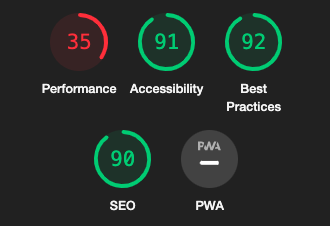
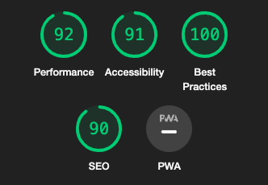

# Art Inspired

[Here is a link to the live final project](https://artinspired.herokuapp.com/)

## Introduction
Art inspired was built to help new designers, communicate with other people in the industry. The idea was from Slack, I wanted to do something similar, where people can create a new chatroom about any topic and anyone can jump on to give their opinion.

## Table of contents
* [Website owner business goals](#Website-owner-business-goals)
* [User goals](#User-goals)
* [Features](#Features)
* [Technology](#Technology)
* [Testing](#Testing)
* [Deployment](#Deployment)
* [Credits](#Credits)
* [Screenshots](#Screenshots)

# User goals
## All user goals
- User is able to create an account.
- User is able to easily navigate through the site.
- User can see what new chat rooms are open.
## Returning user goals
- User can easily log back on.
- User is able to easily find recent activity.
- User can join into conversations.
## Website owner business goals
- Anyone is welcome to join to help create a bigger community.
- No limit to messages so communications can get interesting.
- To be able to edit or delete chat rooms and conversations.

# Features
## Clean structure
The website is designed to give the user a great experience and to be user-friendly on all types of devices. There will be no difference in the experience users have when on a mobile compared to a laptop!

### Wireframes
I used Adobe XD to create my wireframes.
#### Wireframe for big screens
 

#### Wireframe for mobile screens
 

### Site styles

#### Colours
* Background Colour - #2d2d39
* Secondary Colour - #3f4156
* Main Typeface Colour - #eee
* Secondary Typeface Colour - #72db89

#### Fonts
* For my fonts I used 'Lato', with a backup off sans-serif.

#### Logo 

* For my logo I used Adobe Illustrator. I used to make logos as a hobbie.
 

[Back to Table of contents](#table-of-contents)

## Features of the Website
The website consists of 9 pages. 

## Navigation bar
* Navigation bar is viable on the top of each page, it is responsive to screen size and will adapt when the size changes.

#### Navigation scheme:
- On the left side there is the logo, which also can be used as a navigation link to the index page.
- On the right side there is a search bar and 3 links, which are:
    - Chat Rooms (Home)
    - Login
    - Register

#### Home
* ##### Topics
- This section holds all of the different topics of the website.
* ##### Feed
- This section shows all of the open chat rooms that are open at that time.
- Each card shows the host name, when it was created, chat room name/description and what topic it covers.
* ##### Recent activity
- This section shows users all the new comments.
- Each card shows the name of the user that replied, when it was sent, the post they are replying to and a snipit of what the message was.

 

[Back to Table of contents](#table-of-contents)

# Technology
### HTML5
* As a structure language.
### CSS
* As a style language
### Font Awesome
* As an icon library for social links.
### Google Fonts
* As a font resource.
### Heroku
* was used for deployment of the live site.
### GitHub
* As a software hosting platform to keep the project in a remote location.
### Git 
* As a version-control system tracking.
### Gitpod
* As a development hosting platform.
### Adobe XD
* As a wireframing tool.
### Adobe Illustrator
* As an Logo creator.

# Frameworks

### Bootstrap

### Django

 

[Back to Table of contents](#table-of-contents)

# Testing
## Functionality Testing
I used Mozilla web developer tools and Chrome developer tools throughout the project for testing and solving problems with responsiveness and style issues.

## Compatibility Testing
The website was tested across multiple virtual mobile devices and browsers. I checked all supported devices in both web developer tools.

I tested on hardware devices such as: Apple Ipad 12 pro, Samsung S20 Ultra smart phone with Android 10 and used a Iphone 5 to compare the difference in size.

# User goals
## All user goals

## User Stories Testing
### As a business owner:
- Anyone is welcome to join to help create a bigger community
    > Everyone is easily able to register for free from the home page.
- No limit to messages so communications can get interesting.
    > I deciided not to set a limit, just to sring the box so it doesn't go on and on.
- To be able to edit or delete chat rooms and conversations.
    > Easy access to different files in /admin.
### As a new customer
- User is able to create an account.
    > Easily able to register from the home page.
- User is able to easily navigate through the site.
    > User can find any information out very easily by clicking on the about us page, which is on the navigation.
- User can see what new chat rooms are open.
    > New rooms pop up at the top of the feed. They also tell the user the date that they were opened.
### As a returning customer
- User can easily log back on.
   > User can find Login button in the header.
- User is able to easily find recent activity.
    > Recent activity is always on the home page.
- User can join into conversations.
    > Users are able to click a chat room and get straight to messaging as long as they are logged in! 
___

Initial screenshot

This confused me for a while

![Lighthouse final screenshot]

I noticed that the tests scores vary from time to time and depend on external libraries as well.

## Code Validation
At the end of the project I used 2 websites to validate the code.
 * [W3C CSS Validator](https://jigsaw.w3.org/css-validator/) to validate CSS
 * [Nu Html Checker](https://validator.w3.org/) to test HTML
 All code passed with no errors or warnings.
 

[Back to Table of contents](#table-of-contents)

# Deployment
## DEPLOYMENT

### Heroku Deployment

This project was developed using [GitPod](https://gitpod.io) and pushed to [GitHub](https://github.com/) then was deployed using [Heroku](https://www.heroku.com/) using the following steps below:

#### Connecting to Heroku

1. Log in to Heroku and create a new app by clicking `New` and `Create New App` and giving it an original name and setting the region to closest to your location.
2. Navigate to `Heroku Resources` and add `Postgres` using the free plan.
3. Create a `requirements.txt` file using the command `pip3 freeze --local > requirements.txt` in the GitPod terminal.
4. Create a `Procfile` with the terminal command `web: gunicorn artinspired.wsgi:application` and at this point checking the Procfile to make sure there is no extra blank line as this can cause issues when deploying to Heroku.
5. Use the loaddata command to load the fixtures for both json files: `python3 manage.py loaddata categories` and `python3 manage.py loaddata products`.
6. If it returns error message: `django.db.utils.OperationalError: FATAL: role <somerandomletters> does not exist` run `unset PGHOSTADDR` in your terminal and run the commands in step 11 again.
7. From the CLI log in to Heroku using command `heroku login -i`.
8. Temporarily disable Collectstatic by running: `heroku:config:set DISABLE_COLLECTSTATIC=1 --app <heroku-app-name>` So that Heroku won't try to collect static files when we deploy.
9. Add Heroku app name to `ALLOWED_HOSTS` in settings.py.
10. Commit changes to GitHub using `git add .`, `git commit -m <commit message>`, `git push`.
11. Then deploy to Heroku using `git push heroku main`.
12. If the git remote isn't initialised you may have to do that first by running `heroku git:remote -a <heroku-app-name>`
13. Create a superuser using command: `heroku run python3 manage.py createsuperuser` so that you can log in to admin as required.
14. From the Heroku dashboard click `Deploy` -> `Deployment Method` and select `GitHub`.
15. Search for your GitHub repo and connect then Enable Automatic Deploys.
16. Generate secret key. Strong secret keys can be obtained from [MiniWebTool](https://miniwebtool.com/django-secret-key-generator/). This automatically generates a secret key 50 characters long with alphanumeric characters and symbols. 
17. Add secret key to GitPod variables and Heroku config vars.
18. Set up Amazon AWS S3 bucket using instructions [below](#amazon-aws)
19. In the dashboard click `Settings` -> `Reveal Config Vars`
20. Set [config vars](#config-vars) using advice below.

 

[Back to Table of contents](#table-of-contents)

# Credits
* To complete this project I used Code Institute student template: [gitpod full template]https://github.com/Code-Institute-Org/gitpod-full-template]

* Ideas and knowledge library:

    * [w3schools.com](https://www.w3schools.com)

    * [css-tricks.com](https://css-tricks.com/)

    * [stackoverflow.com](https://stackoverflow.com/)
    
    * [codepen.io](https://codepen.io/)

## Code:

 

[Back to Table of contents](#table-of-contents)

# Screenshots
## Project Screenshots

I ran out of Time, my time management for this project was not good. I spent to much time going back over python.

[Back to Table of contents](#table-of-contents)
